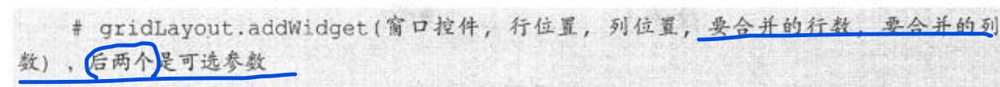
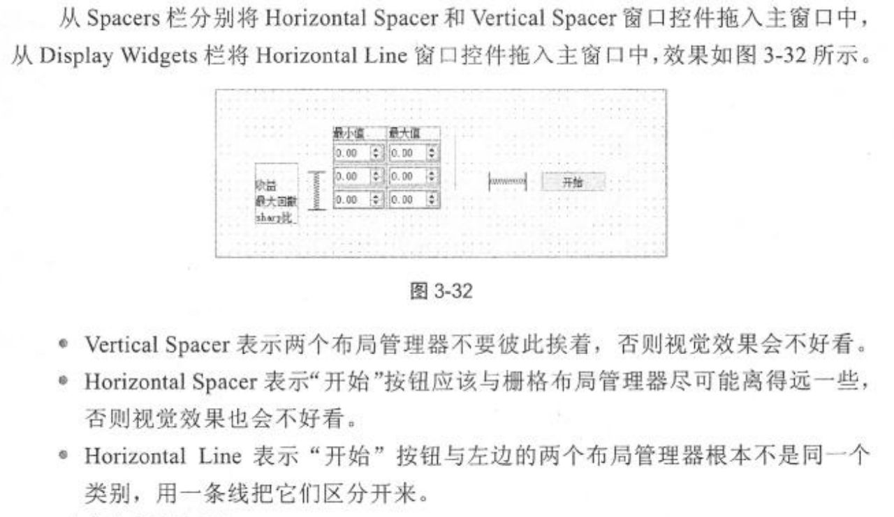
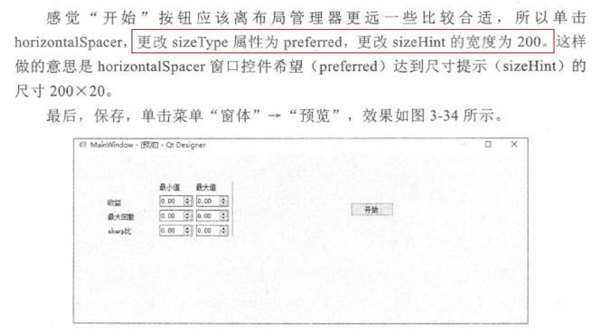
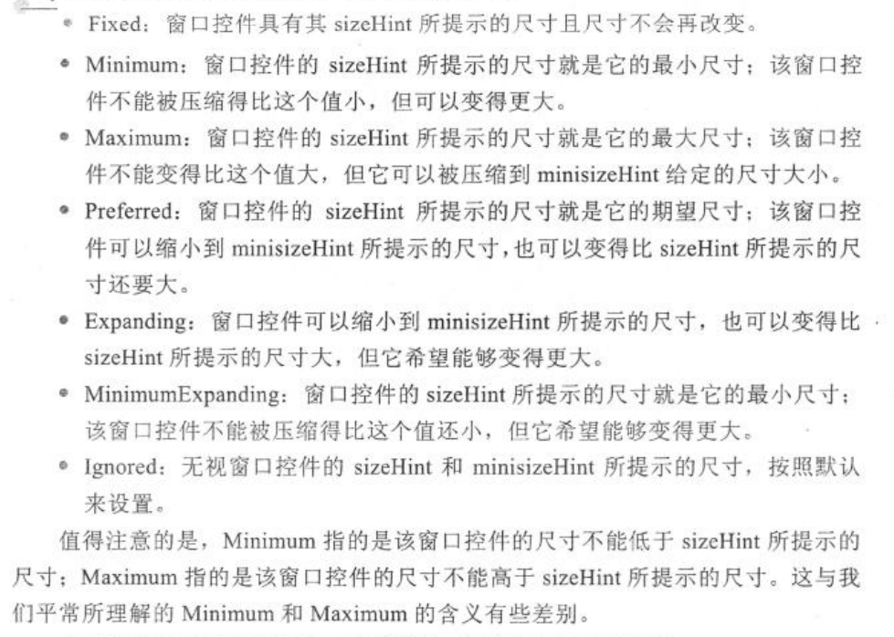
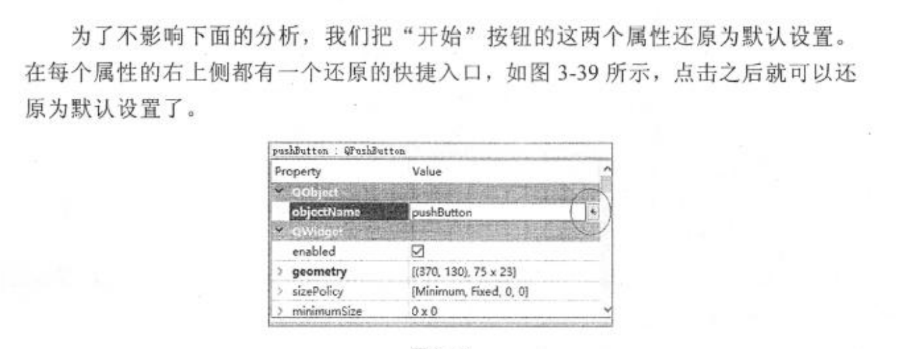

# PyQT

-----

## ui文件转换为py文件

```text
 pyuic5 -o .\firstMainWin.py .\firstMainWin.ui
  pyuic5 -o 目标文件名.py 源文件.ui
```

```python
# -*- coding: utf-8 -*-

'''
    【简介】
	ui转换成py的转换工具
     
'''

import os 
import os.path 

# UI文件所在的路径 
dir = './'  

# 列出目录下的所有ui文件
def listUiFile(): 
	list = []
	files = os.listdir(dir)  
	for filename in files:  
		#print( dir + os.sep + f  )
		#print(filename)
		if os.path.splitext(filename)[1] == '.ui':
			list.append(filename)
	
	return list

# 把后缀为ui的文件改成后缀为py的文件名	
def transPyFile(filename): 
	return os.path.splitext(filename)[0] + '.py' 

# 调用系统命令把ui转换成py
def runMain():
	list = listUiFile()
	for uifile in list :
		pyfile = transPyFile(uifile)
		cmd = 'pyuic5 -o {pyfile} {uifile}'.format(pyfile=pyfile,uifile=uifile)  
		#print(cmd)
		os.system(cmd)

###### 程序的主入口		
if __name__ == "__main__":  	
	runMain()

```

------------

## 控件布局





### Spacer

利用Spacer栏的控件,来修改组件之间的间隔.若希望控件距离可控需要对哪个属性进行修改?

```
sizeType
sizeHint
```



### 布局调控



----------------

## 控件还原



----

## 控件大小

sizeHint:尺寸提示

minimumSize:最小尺寸

----------

## 加载资源文件

案例4-7


---------


## 记录

第一天101页